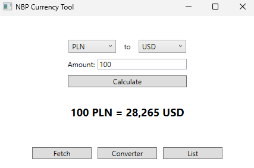
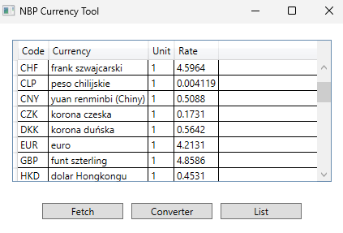
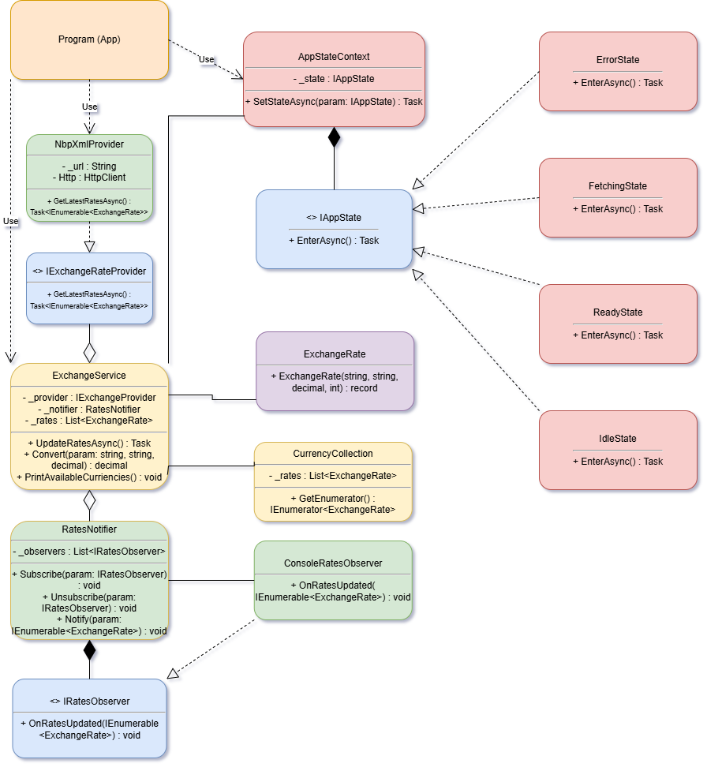

# NBP Currency Tool (WPF)

A desktop currency exchange tool in **C# WPF** that downloads current exchange rates from the National Bank of Poland (NBP) and allows easy conversion between currencies. It includes a simple GUI with a converter and a list of all available rates.

## Features

- Download and update exchange rates from NBP (Table A)
- Convert amounts between any two currencies
- View all available currencies in a sortable, resizable table
- Status messages with temporary pop-ups and fade animations
- Handles decimal input with commas or dots
- Error handling for network failures
- Optional code modification – published executable works standalone

## Technologies

- **.NET 9 / C#**
- **WPF** for GUI
- **MVVM pattern** with `INotifyPropertyChanged`
- **HttpClient + LINQ to XML** for data retrieval
- **NUnit 3** for unit tests
- Publish includes all required DLLs, so Visual Studio is optional for running the app ([see](publish))

## Screenshots

  
*Converter view with amount input, currency selection, and result display*  

  
*Currency list view with sortable rates table*  

## UML Diagram

  

## Launch (Development)

1. Clone the repository:

```bash
git clone https://github.com/Zorquan04/nbp-currency-tool.git
```

2. Open the WPF project in Visual Studio 2022 or newer
3. Make sure the startup project is NbpCurrencyTool.Wpf
4. Run the application → F5 or dotnet run

## Usage

- Converter view: select currencies, type amount, click Calculate → see result
- List view: displays all available currencies, sortable and resizable
- Fetch button: updates the rates from NBP

## Tests

Unit tests include ([see](NbpCurrencyTool.Tests/ExchangeServiceTests.cs)):

- Currency conversion logic
- Mocked exchange rate downloads
- Error handling with incorrect/missing data

Run tests using:

```bash
dotnet test
```

## Notes

- Input supports decimal amounts with commas
- Status messages appear briefly with fade animation
- MVVM structure with clear property change notifications and commands
